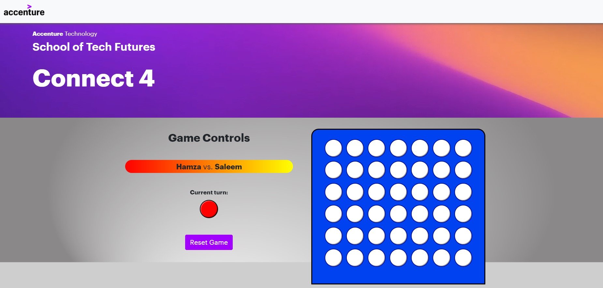

# Connect 4


Accenture School of Tech Futures project by Hamza Saleem

## Contents

 * Introduction
 * Cloning
 * Build and Run
 * Contributing


## Introduction
This projects provides the code for a simple "Connect 4" game.


## Cloning
In your coding environment of choice, enter the following command:

```bash
git clone https://github.com/School-Of-Tech-Futures-UK/hamza-git-demo.git
```

## Build and Run
In order to run execute the code, enter the following code into the command line:
```bash
node ./scoreboard.js
```
NOTE: Ensure your terminal is pointing to the directory where the "Connect 4" folder is located e.g. 
```bash
C:\Users\[your_username]\Connect4
```

In your web browser, enter:

http://localhost:4000/connect4

> This will allow you to access the game

http://localhost:4000/scoreboard 

> This will allow you to view how the winner's score is being saved

The scores are populated in the file
```bash
leaderboard.json
```
> This file contains the names and scores of the winners. To reset the leaderboard, the contents of this file should be cleared and initialised with just an empty array i.e.
```bash
[]
```

## Contributing
If you have a suggestion that would make this better, please fork the repo and create a pull request. You can also simply open an issue with the tag "enhancement".

- Fork the Project
- Create your Feature Branch (git checkout -b feature/AmazingFeature)
- Commit your Changes (git commit -m 'Add some AmazingFeature')
- Push to the Branch (git push origin feature/AmazingFeature)
- Open a Pull Request